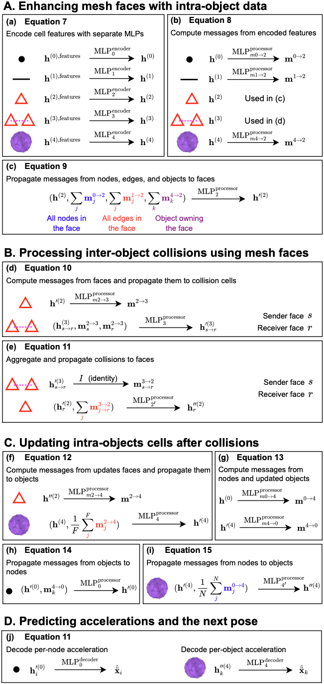

# Higher-Order Physics-informed topological Network (HOPNet)

This repo contains the code used to develop `HOPNet`, part of the publication titled
"Physics meets Topology: Physics-informed topological neural networks for learning
rigid body dynamics". An improved version with proper Python packaging will be made
publicly available on GitHub after acceptance.

## 0. Table of Contents

- [Higher-Order Physics-informed topological Network (HOPNet)](#higher-order-physics-informed-topological-network-hopnet)
  - [0. Table of Contents](#0-table-of-contents)
  - [1. System Requirements](#1-system-requirements)
  - [2. Setup](#2-setup)
    - [2.1. Docker Image (x86\_64 only, no ARM64)](#21-docker-image-x86_64-only-no-arm64)
    - [2.2. Manual Setup](#22-manual-setup)
  - [3. Getting Started](#3-getting-started)
    - [3.1. Generating a Dataset (*optional*)](#31-generating-a-dataset-optional)
    - [3.2. Preprocessing the Data (*training only*)](#32-preprocessing-the-data-training-only)
    - [3.3. Computing Normalization Parameters (*optional*)](#33-computing-normalization-parameters-optional)
    - [3.4. Training a Model (*optional*)](#34-training-a-model-optional)
    - [3.5. Inferring a Model](#35-inferring-a-model)
    - [3.6. Visualizing Rollout Trajectories](#36-visualizing-rollout-trajectories)
  - [4. Available Pretrained Models](#4-available-pretrained-models)
  - [5. HOPNet model architecture](#5-hopnet-model-architecture)
  - [6. FIGNet reimplemented baseline](#6-fignet-reimplemented-baseline)
    - [6.1 FIGNet training configurations](#61-fignet-training-configurations)
    - [6.2 Data preprocessing (required for training only)](#62-data-preprocessing-required-for-training-only)
    - [6.3 FIGNet model training (optional)](#63-fignet-model-training-optional)
    - [6.4 FIGNet model inference](#64-fignet-model-inference)
    - [6.5 FIGNet errors computation](#65-fignet-errors-computation)

## 1. System Requirements

- Operating system: Windows 11 or Ubuntu 22.04
- Python 3.10 or 3.11 (developed and tested on 3.10.12 and 3.11.12)

## 2. Setup

To train and evaluate a HOPNet model, a HOPNet ablation, or FIGNet reimplemented, you 
can use either the [Docker image](#21-docker-image) or the [Manual Setup](#22-manual-setup).
To interactively visualize rollout trajectories with the included Jupyter notebook, you
will need to use the [Manual Setup](#22-manual-setup).

**Note**: The proposed setup here does not contain all the dependencies to generate the
`MOVi` datasets. The dataset generation must be done with the
[`Kubric`](https://github.com/AmauryWEI/kubric) Docker image (due to its complex
dependencies on PyBullet and Blender).

### 2.1. Docker Image (x86_64 only, no ARM64)

**Note**: The Docker image can only be built on x86_64 architectures, not arm64. This is
due to the [gudhi](https://pypi.org/project/gudhi/) package having pre-built images only
for Linux x86_64 (not Linux arm64). Alternatively, you could build the package from
source inside the Dockerfile for arm64 platforms.

1. Build the `hopnet` Docker image included in this repository with the following command:

```bash
docker build -t hopnet:latest .
```

2. Create a Docker container using the `hopnet` Docker image you just built:

```bash
# On Windows Powershell
docker run --name hopnet -d -v ${PWD}:/workspace/hopnet/ hopnet
# On Linux
docker run --name hopnet -d -v ${pwd}:/workspace/hopnet/ hopnet
```

3. Start the Docker container and get an interactive terminal:

```bash
# Not needed if you just created the container
docker start hopnet
# Get an interactive terminal inside the container
docker exec -it hopnet bash
```

4. Use the Docker container for training or inference:

```bash
# This hopnet repo is connected to the Docker container in /workspace/hopnet
cd /workspace/hopnet
# Run any python command you want (see "Getting Started" chapter 3)
...
```

5. Stop the Docker container:

```bash
docker stop hopnet
```

6. Delete the Docker container and `hopnet` image:

```bash
# Delete the container (the hopnet Docker image will remain)
docker rm hopnet
# Delete the hopnet Docker image
docker rmi hopnet
```

### 2.2. Manual Setup

1. Create a new Python virtual environment (must be Python 3.11):

```bash
# Create the virtual environment named "hopnet_venv"
python -m venv hopnet_venv
# Activate it
./hopnet_venv/Scripts/activate
# Update package installation tools
python -m pip install -U pip wheel setuptools
```

2. Install [TopoModelX](https://github.com/pyt-team/TopoModelX) commit
[2267768](https://github.com/pyt-team/TopoModelX/commit/226776822925b0984b1c5dbd097234d7fcbc274e):

```bash
# Clone the TopoModelX repository 
git clone https://github.com/pyt-team/TopoModelX
cd TopoModelX
git checkout 226776822925b0984b1c5dbd097234d7fcbc274e
# Install the TopoModelX package
pip install -e '.[all]'
```

3. Install the rest of the Python dependencies:

```bash
# First, get back to the root folder
cd ..
# Then, install the HOPNet dependencies sequentially
pip install -r requirements.txt
pip install torch-scatter torch-sparse torch-cluster -f https://data.pyg.org/whl/torch-2.4.1+cu124.html
# Finally, install the FIGNet reimplemented dependencies
sudo apt install libsm6 libxext6 libgl1-mesa-glx libosmesa6 # Linux only
export MUJOCO_GL="osmesa" # Put this in your .bashrc or .zshrc
export PYOPENGL_PLATFORM="osmesa" # Put this in your .bashrc or .zshrc
cd fignet
pip install 'git+https://github.com/facebookresearch/pytorch3d.git@stable'
pip install -r requirements.txt
pip install -e .
python -m robosuite.scripts.setup_macros
```

## 3. Getting Started

This chapter contains detailed instructions to replicate end-to-end the reported results
from scratch. However, to enable quick testing, pretrained models are provided as
checkpoints.

If you directly want to compute results and generate rollout trajectories, you can move
directly to section [Inferring a Model](#35-inferring-a-model) and
[Generating Rollout Trajectories](#36-visualizing-rollout-trajectories).

### 3.1. Generating a Dataset (*optional*)

This repository includes 10 samples of each dataset `MOVi-spheres`, `MOVi-A`, and
`MOVi-B`. To generate the complete datasets with 1'200 samples each, build the
[Kubric](https://github.com/AmauryWEI/kubric) Docker image and generate additional
samples with the custom script `/data/generate_movi_dataset.py`.

```bash
# Generate the MOVi-spheres dataset (must be ran inside the Kubric Docker image)
python generate_dataset.py --movis --out_dir=./movis

# Generate the MOVi-A dataset (must be ran inside the Kubric Docker image)
python generate_dataset.py --movia --out_dir=./movis

# Generate the MOVi-B dataset (must be ran inside the Kubric Docker image)
python generate_dataset.py --movib --out_dir=./movib
```

Each dataset sample corresponds to one individual random seed from 1 to 1'200. Each
sample generated by [Kubric](https://github.com/AmauryWEI/kubric) contains three files:

- `metadata.json`: contains all the necessary information
- `events.json`: file automatically generated by Kubric, not required, not used
- `rgba.mp4`: video of the evolving objects, for visualization purposes only

**Warning**: Generating the complete 1'200 samples for each dataset can take a lot of time
depending on your hardware (up to multiple days).

**Note**: The samples provided under `/samples` also contain `collisions.json` files
(generated with a collision radius $d_c=0.1$, more details in the
[Preprocessing](#32-preprocessing-the-data-training-only) section), which are already
provided to save time in testing the code.

### 3.2. Preprocessing the Data (*training only*)

Once the dataset has been generated, combinatorial complexes (CCs) and incidence
matrices must be pre-computed to train a model. This step is only required for training
and inferring models, and not for autoregressive rollout.

All versions of HOPNet use the same combinatorial complexes and incidence matrices.
However, the ablated version of HOPNet (without object cells $X^{(4)}$) require separate
ones (due to the added virtual nodes).

To speed-up the generation of different combinatorial complexes, the pre-computed
collisions by the `data/create_ccs.py` script are stored in `collisions.json` files.

```bash
# Usage
python data/create_ccs.py <dataset_dir> [--nox4]

# Example: generate CCs for standard HOPNet with d_c = 0.1
python data/create_ccs.py ./samples/MOVi-A --collision_radius=0.1
# Example: generate CCs for ablated HOPNet without object cells with d_c=0.1
python data/create_ccs.py ./samples/MOVi-A --collision_radius=0.1 --nox4
```

**Warning**: Generating the combinatorial complexes archives for each dataset can take a
lot of time depending on your hardware (up to multiple days). This is especially true
for the `MOVi-B` dataset, as object meshes are very complex.

### 3.3. Computing Normalization Parameters (*optional*)

The normalization parameters are based on global dataset statistics and required for
training, inference, and rollout generation.

To avoid the need of generating all datasets to test pretrained models, the
normalization parameters are already included inside each dataset folder in the
`/samples/` directory.

However, if you want to generate them yourselves, you can use the included script `/data/compute_normalization.py`:

```bash
# Usage
python data/compute_normalization.py <dataset_dir> [--nox4]

# Example: compute the normalization parameters on MOVi-spheres for standard HOPNet
python data/compute_normalization.py ./samples/MOVi-spheres --nox4
```

### 3.4. Training a Model (*optional*)

To train a HOPNet model (including ablated versions), use the `scripts/main.py` script.
It supports different learning rates, epochs, and includes
[Tensorboard](https://www.tensorflow.org/tensorboard?hl=fr) and
[Weights & Biases](https://wandb.ai) monitoring.

Model checkpoints are saved at the end of each epoch in the log directory provided as
argument. The names are structured as follows:
`<MODEL>_c<EMBEDDING>_l<MP_LAYERS>_mlp<MLP_LAYERS>_e<EPOCH_NUM>.pt`.

```bash
# Usage
python scripts/main.py <dataset_dir> --log_dir <log_dir> --model=<model> --normalization=<normalization_path>

# Example: train a HOPNet model on the included samples for 40 epochs
python scripts/main.py ./samples/MOVi-spheres --log_dir ./tmp/hopnet_movis --model=HOPNet --epochs=40 --normalization=./samples/normalization-movis.npy
# Example: train an ablated HOPNet model without object cells
python scripts/main.py ./samples/MOVi-A --log_dir ./tmp/hopnet_movianox4 --model=NoObjectCells --epochs=40 --normalization=./samples/normalization-movia-nox4.npy
```

**Warning**: Due to the dynamic nature of the combinatorial complexes, the main training
bottleneck is CPU and disk speed rather than GPU memory size. Training a model
(especially ablated versions) can take up to a few days depending on your hardware.

### 3.5. Inferring a Model

To compute the autoregressive rollout of a model and its RMSE errors, use the
`scripts/main.py` script. The computed autoregressive trajectories are saved as
`<SAMPLE_ID>.npy` files inside the log directory provided as argument. The autoregressive
rollout is only performed on the testing set.

After computing the autoregressive trajectories, a `rollout.npy` file containing all
RMSE errors is computed. To visualize and plot the errors' evolution over time, use the
`/notebooks/visualize_errors.ipynb` Jupyter notebook.

```bash
# Usage
python scripts/main.py <dataset_dir> --log_dir <log_dir> --model=<model> --checkpoint=<pt_path> --normalization=<npy_path> --rollout

# Example: test a pretrained HOPNet model on the included samples
python scripts/main.py ./samples/MOVi-spheres --log_dir ./tmp/hopnet_movis/e39/ --model=HOPNet --checkpoint=./checkpoints/models_seed0_e39.pt  --normalization=./samples/normalization-movis.npy --rollout
# Example: train an ablated HOPNet model without object cells
python scripts/main.py ./samples/MOVi-A --log_dir ./tmp/hopnet_movianox4/e39/ --model=NoObjectCells --checkpoint=./checkpoints/movia-nox4_seed0_e39.pt  --normalization=./samples/normalization-movia-nox4.npy --rollout
```

### 3.6. Visualizing Rollout Trajectories

To visualize autoregressive rollout trajectories of a model, use the
`/notebooks/visualize_rollout.ipynb` Jupyter notebook. Make sure to match the model with
its configuration.

## 4. Available Pretrained Models

We supply 4 pretrained checkpoint models used to compute the results in the main article
and supplementary information. They are available in the `/checkpoints` directory. These
models can be tested with both the `/scripts/main.py` script and the
`/notebooks/visualize_rollout.ipynb` Jupyter notebook.

Here are more details regarding their training, hyperparameters, and normalization files:

| Checkpoint                 | Model                              | Training set | Normalization                  | Activation | Channels | Layers | MLP layers |
| -------------------------- | ---------------------------------- | ------------ | ------------------------------ | ---------- | -------- | ------ | ---------- |
| `models_seed0_e39.pt`      | HOPNet                             | MOVi-spheres | `normalization-movis.npy`      | ReLU       | 128      | 1      | 2          |
| `models_seed2_e39.pt`      | HOPNet                             | MOVi-spheres | `normalization-movis.npy`      | ReLU       | 128      | 1      | 2          |
| `modela_seed2_e39.pt`      | HOPNet                             | MOVi-A       | `normalization-movia.npy`      | ReLU       | 128      | 1      | 2          |
| `modelb_seed0_e39.pt`      | HOPNet                             | MOVi-B       | `normalization-movib.npy`      | ReLU       | 128      | 1      | 2          |
| `movib-alt_seed0_e39.pt`   | HOPNet                             | MOVi-B (alt) | `normalization-movib.npy`      | ReLU       | 128      | 1      | 2          |
| `movia-nox4_seed0_e39.pt`  | Ablation (no object cells)         | MOVi-A       | `normalization-movia-nox4.npy` | ReLU       | 128      | 1      | 2          |
| `movia-noseq_seed1_e39.pt` | Ablation (no physics-informed MP)  | MOVi-A       | `normalization-movia.npy`      | ReLU       | 64       | 3      | 2          |
| `gelu_seed0_e39.pt`        | Supplemental (activation function) | MOVi-spheres | `normalization-movis.npy`      | GELU       | 128      | 1      | 2          |

## 5. HOPNet model architecture

For a detailed overview of the message-passing architecture of our HOPNet model, please
refer to the figure available below.



## 6. FIGNet reimplemented baseline

The [`fignet/`](fignet/) folder contains an unofficial reimplementation of
[FIGNet](https://arxiv.org/abs/2212.03574). It has been taken from 
https://github.com/jongyaoY/fignet (commit 
[f72f693c4a30ba30bcd4fccaf8bad76d92ab2a17](https://github.com/jongyaoY/fignet/commit/f72f693c4a30ba30bcd4fccaf8bad76d92ab2a17))
and modified to support the `MOVi` datasets used in HOPNet.

It is possible to train and evaluate FIGNet reimplementations on the MOVi datasets using
the following instructions.

**Note**: None of the core of the reimplementation has been modified (model, training
strategy, collision processing, ...). All experiments from the
[original reimplementation](https://github.com/jongyaoY/fignet) are still supported and
training configurations untouched. The only changes are to support the MOVi dataset, 
enhance the validation step (to compute one-step errors on the full validation set) and
the addition of a new [`infer.py`](fignet/scripts/infer.py) script to output model 
rollout predictions to `.npy` files (for error computation).

### 6.1 FIGNet training configurations

First, you should modify the dataset location inside the configuration files under 
[`fignet/config`](fignet/config/):

```yaml
# fignet/config/train_movis.yaml
data_path: "<YOUR_MOVI_SPHERES_ROOT_DIRECTORY>"
test_data_path: "<YOUR_MOVI_SPHERES_ROOT_DIRECTORY>"
...

# fignet/config/train_movia.yaml
data_path: "<YOUR_MOVI_A_ROOT_DIRECTORY>"
test_data_path: "<YOUR_MOVI_A_ROOT_DIRECTORY>"

# fignet/config/train_movib.yaml
data_path: "<YOUR_MOVI_B_ROOT_DIRECTORY>"
test_data_path: "<YOUR_MOVI_B_ROOT_DIRECTORY>"
```

### 6.2 Data preprocessing (required for training only)

The MOVi datasets need to be preprocessed before training (not required for inference):

```bash
cd fignet
# Example: preprocess the MOVi-spheres dataset
python scripts/preprocess_data_movi.py --config_file config/train_movis.yaml --dataset_path <YOUR_MOVI_SPHERES_ROOT_DIRECTORY> --num_workers <CPU_CORES>
```

### 6.3 FIGNet model training (optional)

You can train a FIGNet model from scratch using the [`scripts/train.py`](fignet/scripts/train.py) 
script. Change the `--config_file` argument if you want to train on another dataset 
(MOVi-A or MOVi-B).

```bash
# Exapmle: Train a model on MOVi-spheres
python scripts/train.py --config_file ./config/train_movis.yaml
```

**Note**: Pretrained checkpoints for each of MOVi dataset are given in the 
[`fignet/checkpoints`](fignet/checkpoints/) directory.

### 6.4 FIGNet model inference

To compute the autoregressive rollouts of a pretrained FIGNet model on a MOVi dataset, 
use the following command:

```bash
# Exapmle: Infer a model on MOVi-spheres
python scripts/infer.py --config_file ./config/train_movis.yaml --checkpoint ./checkpoints/fignets_seed2_1M.pt
```

A `rollout/` folder will be created next to the pretrained model checkpoint.

### 6.5 FIGNet errors computation

Finally, to compute the rollout errors, use the `main.py` script from the HOPNet
codebase as follows:

```bash
cd .. # Go back to the root of the repository
python scripts/main.py <YOUR_MOVI_DATASET_ROOT_DIRECTORY> --log_dir <ROLLOUT_DIRECTORY> --errors
```
